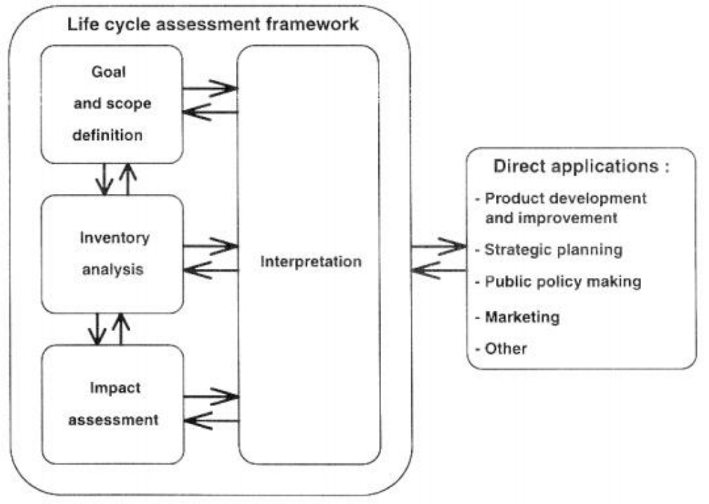

# 2 LCA 方法论

## 2.1 LCI、LCIA 和 LCA

ecoinvent 数据库建立在国际标准化的生命周期评估 (LCA)方法之上标准化组织（国际标准化组织 (ISO) 2006a；国际标准化组织 (ISO)
2006b)。 LCA
研究系统地和充分地解决环境问题产品系统方面，从原材料采购到最终处置（从“摇篮到坟墓”）。方法区分四个主要步骤，即
(1）目标和范围定义，(2) 清单分析，(3) 影响评估，和 
(4) 解释（见图 2.1）。
   
   图 2.1 LCA 的阶段（

国际标准化组织 (ISO) 2006a）ecoinvent 数据库的重点是编译基本构建块（LCI 数据集），代表人类活动的单个单元过程及其与环境的交流，以及这些
LCI
的组合数据集通过在生命周期库存分析（LCI）中使用系统模型，从而构建生命周期库存。尽管如此，ecoinvent 数据库还包含有关影响评估 (
LCIA) 方法和结果的数据将这些方法应用于 LCI 数据。然而，关于 LCIA 的工作仅限于已经开发了 LCIA 方法，例如生态稀缺性或生态指标方法。没有新的（“ecoinvent”）方法已开发（除了没有“官方”或统一实施的累积能源需求 CED存在）。 LCIA
方法的实施旨在为如何结合 ecoinvent LCI 提供指导具有当前可用 LCIA 方法的特征、损坏或加权因子的结果。

## 2.2归因和结果建模

对于生命周期库存分析，通常区分结果建模和归因建模（参见埃克瓦尔 1999；弗里施克内西 1997；几内亚等人。 2001；魏德玛
2003，魏德玛和埃克瓦尔 2009）。 ecoinvent 数据库其模块化结构提供多产品单元流程原始数据适合支持这两种类型的系统建模。LCA
系统模型在两个方面有所不同：
1. 将投入与平均或不受约束的供应商联系起来。
2. 在产品联合生产的情况下达到单一产品系统的程序，将多产品系统划分（分配）为两个或多个单产品系统，或替代（系统扩展），
通过包括供应的平衡变化来消除副产品以及受影响市场的需求。

3. 为了允许计算不同的系统模型，每个活动都需要以下数据：
- 申请分配的产品属性数量（例如价格、火用、干质量、碳含量）。
- 参考产品（确定产品）与副产品的区别，因为后者必须使用替换从模型中消除。
- 市场趋势，因为相应的模型区分不同的供应商会受到收缩和增长的影响市场。
- 技术水平，因为结果模型只考虑具有特定技术水平的活动受到影响需求的变化。

这些数据包含在各个数据集中的具体方式在第 4 章到第 6 章中进行了描述。第 14 章提供了不同系统模型的构建。
