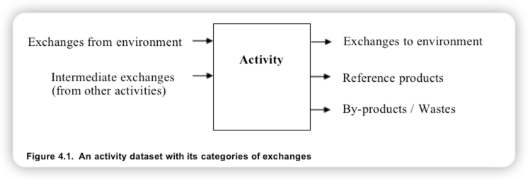

# 4 数据集类型术语

数据集可以指活动数据集和影响评估 (LCIA) 数据集。 LCIA 数据集在第 4.13 章。本章的所有其他部分专门处理活动数据集。

## 4.1 活动数据集、交换和元数据

ecoinvent 活动数据集表示人类活动的单元过程及其与环境和与其他人类活动。以下子章节描述了几种类型的数据集，但它们都包含在它们在输入端和输出端都有交换，见图
4.1。活动

带有交易所类别的活动数据集与环境之间的交换，也称为基本交换1，位于输入端和输出端侧分别。所有其他的交换都是中间交换，即活动之间的交换。在输出端我们区分之间：-
参考产品- 副产品/废物参考产品和副产品/废物之间的区别是特定于活动的，即同一产品可以是一项活动的参考产品和另一项活动的副产品/废物。这些区别将在以下子章节中更详细地描述。在输入端，ecoSpold
v2 格式允许将中间交换区分为材料/燃料（使用质量）、电/热（能量单位，无质量）和服务（无质量或能量属性），但这ecoinvent
数据库中没有积极使用这种区别。在输出端，ecoSpold v2 格式允许进一步区分处理材料和添加库存。这些区别仅在 ecoinvent
内部使用创建互连时的数据库数据集，见第 4.14
章。除了交换之外，数据集还根据元数据进行描述，即识别活动本身的数据，就其地理、技术和时间有效性而言，它的起源、代表性和有效性数据和管理信息。这些元数据的所有相关方面都在本报告的后续章节中进行了描述。

## 4.1.1 与环境之间的交流

来自环境的交换是从空气中提取的资源和化学反应物（例如CO2、O2、N2)
、进入人类活动或进入野外收获的生物量的水或土壤。还有土地改造、土地占用和工作时间记录为来自自然（提供的服务）的交换，社会或经济环境。也是经济初级生产要素的投入（劳动力成本、净税收、净运营盈余和租金（见第
6.4
章）被记录为来自环境的交换，尽管测量为这些投入的经济支出。与环境的交换是对不同环境部分（例如空气、水）的排放。为了将人类活动与其环境区分开来，需要结合以下两个原则：1)
“自然背景”，即包括没有活动就不会发生的一切，并排除即使没有活动也会发生的任何事情。2）“人力管理”，即包括在人力管理下发生的一切，排除任何发生在人力管理终止后。这些原则、它们的局限性以及它们的实际实施在附录
A 中有进一步的描述。

## 4.1.2 参考产品

如果活动只有一种产品输出，则这是参考产品。参考产品要么是好的要么一项服务。具有多个产品的活动也只有一个参考产品，除了：如果活动是组合生产，则（组合）产品的产量可以可以独立变化，因此可以将活动细分为单独的活动，每个活动只有一个参考产品，见第
5.3 章，如果活动中有更多产品没有替代生产路线。如果更多比联合生产的一种产品没有替代生产路线，所有这些都是参考产品。参考产品是那些需求变化会影响生产量的产品活动（也称为结果建模中的决定性产品，参见
Weidema & Ekvall
2009）。在大多数情况下，副产品很容易与参考产品区分开来。通常副产品接近废物，因此甚至没有得到充分利用，例如稻草。参考产品和副产品之间的区别是必要的，因为它与识别产品相关需要额外治疗的，例如对于回收利用，特别是对于具有替代的系统模型，其中副产品的供应被平衡以达到单一产品活动。给数据提供者的额外建议：对于处理活动，请参阅第
4.8 章，参考产品是接收材料的负物理流动用于处理，对应于处理此材料的服务。输出是否为参考产品取决于当地条件，并且会随时间而变化。具有不止一种参考产品的情况示例，以及对数据提供者的额外建议第
11.1
章提供。[相对于 ecoinvent 版本 2 的变化：参考产品和副产品之间的区别是新的。第 2 版中的所有多产品活动都经过审查，并确定了参考产品。许多治疗活动缺少参考产品。这些是根据原始 ecoinvent 报告中的信息添加的。版本 2 中的许多活动都有参考产品，这些产品不是商品或服务，而是指燃料输入，例如。 “柴油，在建筑机器中燃烧”。通常，这些参考产品用于产生热量的活动。对于这些活动，所有名称中带有“烧入”一词的活动都添加了热量或功的参考产品，根据数据库中的现有信息（如果可用）进行计算，并且数据集与相应的产热活动（如果可用）合并。修改后的参考产品已经过原始数据集作者和/或编辑的审查。]

## 4.1.3 副产品和废物

ecoinvent
数据库不区分副产品和废物，也不应用任何特定的废物定义。因此，如果不同的数据库用户希望区分废物，他们可以应用他们自己的废物定义来自副产品。废物和副产品都可能——或转化为——对其他产品系统有价值的投入条款。根据他们对进一步治疗或转化的需要，他们可能与不同的治疗活动，见第
4.8 章。根据第 4.1.2
章对参考产品的定义，副产品/废物（任何既不是参考产品也不是对环境的交换）必须有替代生产路线或将副产品/废物转化为具有替代生产路线的产品或成为环境的交换。[相对于 ecoinvent 版本 2 的变化：在 ecoinvent 版本 2 中，废物处理被记录为提供废物的活动的服务投入。所有此类废物处理服务都已被审查并表示为废物的负面输出。名称更改已由原始数据集作者和/或编辑审查。对于现在已被确定为副产品的第 2 版中的许多产品（例如稻草、氢氧化钠），缺少将副产品作为其参考产品或作为处理输入的活动。这些活动现已添加。]
