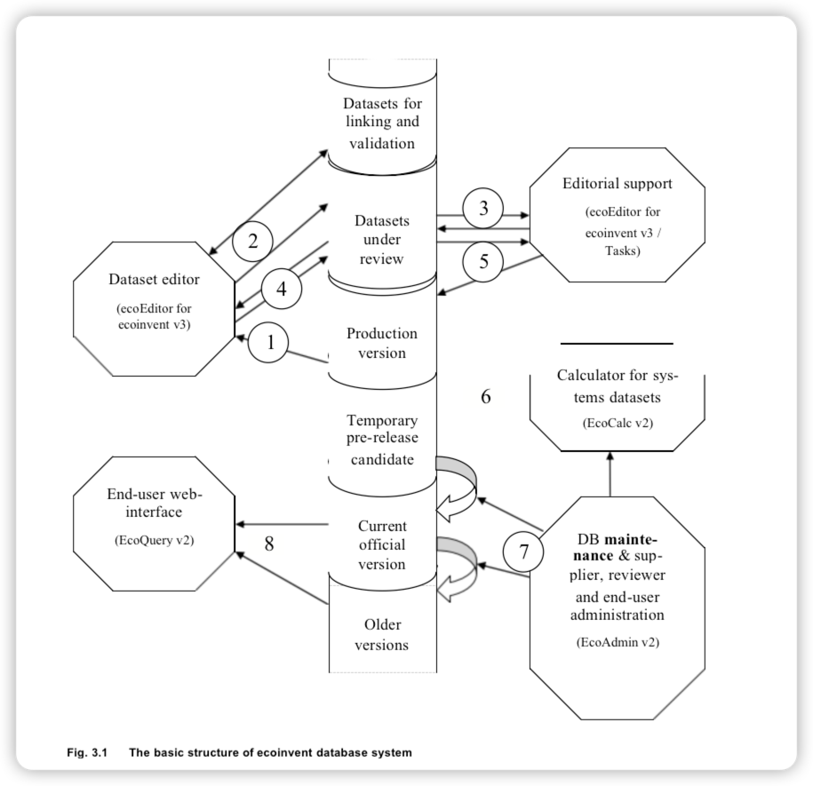

# 3 The basic structure of the ecoinvent database

The basic building blocks of the ecoinvent database are LCI datasets, representing the individual unit processes of
human activities and their exchanges with the environment. For a more detailed description of the concept of datasets
and exchanges, see Chapter4.1. However, the ecoinvent database is not just a library of unlinked LCI datasets. The
datasets are also interlinked, so that all intermediate goods and service inputs to a unit process, be it the
consumption of electricity, the demand for working materials, or the use of capital equipment, are linked to other
unit processes that supply these intermediate goods and services. The accumulated LCI result for a dataset is
calculated by following the supplies of intermediate inputs of each dataset and summing up the environmental exchanges
of these interlinked datasets. The calculation is done by matrix inversion, see Chapter14.8for details. This implies
that any change in one unit process dataset will influence the accumulated LCI results of almost all other
datasets.
In addition to the unit process LCI datasets and the accumulated LCI results for these datasets, the ecoinvent database
also contains data on impact assessment (LCIA) methods and results of applying these methods to the LCI data.
A large, network-based database and efficient calculation routines are required for handling, storage, calculation and
presentation of data. These components are partly based on preceding work performed at ETH Zurich (Frischknecht & Kolm
1995).
The following text refers to Figure 3.1 and describes first the different sections of the database itself, and next the
flow of a dataset through the editorial process.
The database consists of several separate sections. Besides the ones mentioned here, which concern only the datasets,
there is also a section for administration of access rights etc. of data providers, reviewers and end users. Also not
shown in the figure is the ‘service layer’ of the database, consisting of functionalities for import, export, validation
etc. that are common for more than one of the satellite components. Many of the functionalities are in practice placed
in this service component, and shared
by the different user interfaces.
From the top down in the figure:
The first section contains incomplete datasets, which gives a data provider the option to use the validation functions
of the database service layer during the editing and before the final submission to review.
The second section contains datasets currently under review, in their different stages of commenting and revision.
The third section contains the production version of the database, which contains all datasets that have currently
passed the review and are therefore uploaded by the final editor for integration into the da- tabase, but which are not
yet part of the current official version.
The fourth section only exists temporarily, when the database administrator initiates the preparation of a new release.
At this point in time, a copy of the current production version becomes the pre- release candidate, which is closed for
further entries. The result calculations are made on this version, and when this has been successfully completed, the
pre-release candidate becomes the new ‘Current official version’, while the previous official version is retained
together with all other older versions.
The current official version is the one accessed by the end-users and resellers through ecoQuery (the web-interface
at www.ecoinvent.org), while they – depending on user rights – also have access to the older versions.

Fig. 3.1 The basic structure of ecoinvent database system

The flow of a dataset through the editorial process (numbers refer to Figure 3. 1) is:
Creating a templatefor editing: To create new datasets in ecoSpold 2 data format and to edit existing datasets, data
providers use the ecoEditor software, specifically developed for ecoinvent version 3. This software is provided by the
ecoinvent centre free of charge and includes some tools for a first au- tomatic validation. The data provider may use
the ecoEditor with a blank template, load a dataset from the production version of the database (1) or work from an
imported, externally sourced XML- file in ecoSpold v1 or v2 format. The ecoSpold data exchange format has evolved from
the interna- tional SPOLD data exchange format   (Weidema 1999)   and is available as Open Source (www.spold.org).
Editing the data: The ecoEditor software includes validation routines to assist in identifying errors in the data before
datasets are submitted for review. Some of these validation routines require on-line

access to the central database (2). As part of the validation, the data provider may download and check the
single-product, interlinked datasets that the database service layer generates from the multi- product, unlinked
datasets received from the data provider.
Having finished the dataset and having applied the available pre-validation functions, the data provid- er submits the
dataset(s) to review, i.e. to the ‘Datasets under review’ part of the database. During this upload, a final automatic
validation is performed in interaction with the production version of the da- tabase.
Editorial process: The editors access the datasets for review through a special read-only-but-add- comments mode of the
ecoEditor software. The procedural management of the review process (which persons, when) and the monitoring of this, is
software-supported (3), and both data providers and edi- tors access the datasets and review comments via a Tasks view
in the ecoEditor software, which also provides access to a log of the review workflow.
During the review process, the dataset(s) may pass back and forth between data provider and review- ers several times (
4), until all assigned reviewers have approved the dataset(s). Each dataset will pass at least 3 independent reviewers
before upload to the database.
After the final approval: The main activity editor uploads the dataset to the production version of the database (5).
When the database administrator initiates the preparation of a new release, the database service layer (ecoCalc v2)
performs the result calculations on the pre-release candidate (6).
The database administrator releases the new ‘Current official version’, while the previous official ver- sion is
retained together with all other older versions (7).
The end-users and resellers access current and older versions through the ecoQuery v2 web-interface (8). Data can be
viewed or downloaded, depending on users’ rights.
